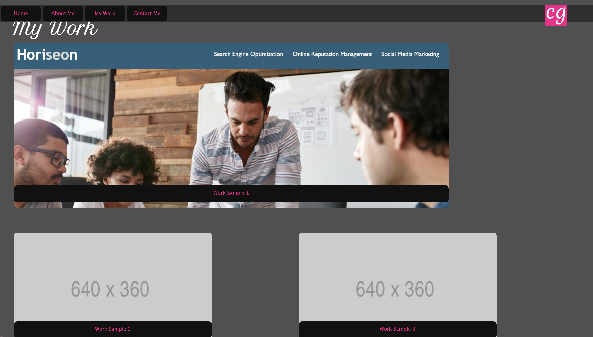
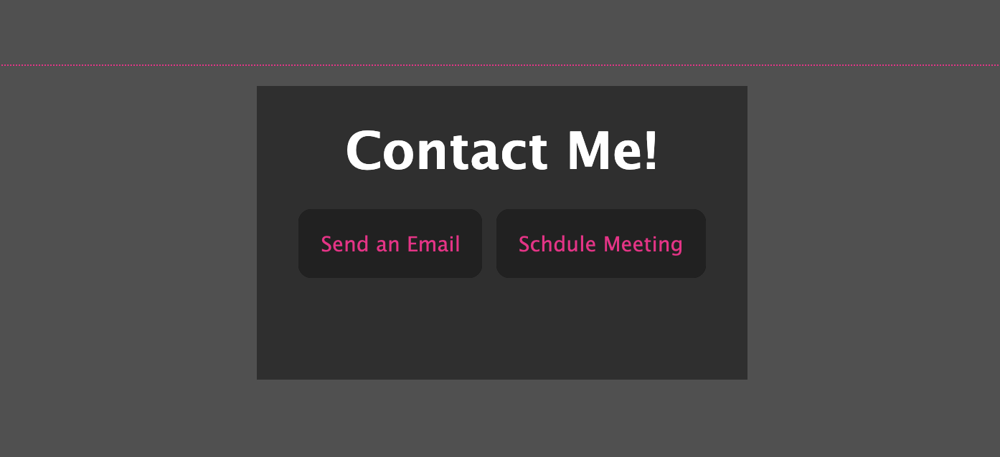

# Caitlyns-Creations

> If you are not willing to learn, no one can help you. If you are determined to learn, no one can stop you. -Zig Ziglar

---
## Caitlyn Griffing's Portfolio
- **Caitlyn's Creations** is my portfolio page that samples some of my web design work. This specific application is composed with only HTML and CSS.

- In the future I plan on adding some CSS Framework and JavaScript.

---

## **Link** and **Preview** of Deployed Web Page

- [Deployed Web Page] (https://caitlyn-griffing.github.io/Caitlyns-Creations/)

---

## Important Links

- [Deployed URL](https://caitlyn-griffing.github.io/Caitlyns-Creations/)
- [GitHub Repo](https://github.com/caitlyn-griffing/Caitlyns-Creations)

---

## Licensing

- [MIT](https://github.com/caitlyn-griffing/Caitlyns-Creations/blob/main/LICENSE)

---

## Contact Information

Caitlyn Griffing

- 469-278-6558

- griffingcaitlyn@gmail.com

[Click to Schedule a *Call With Me!*](https://calendly.com/caitlyngriffing/15min)
